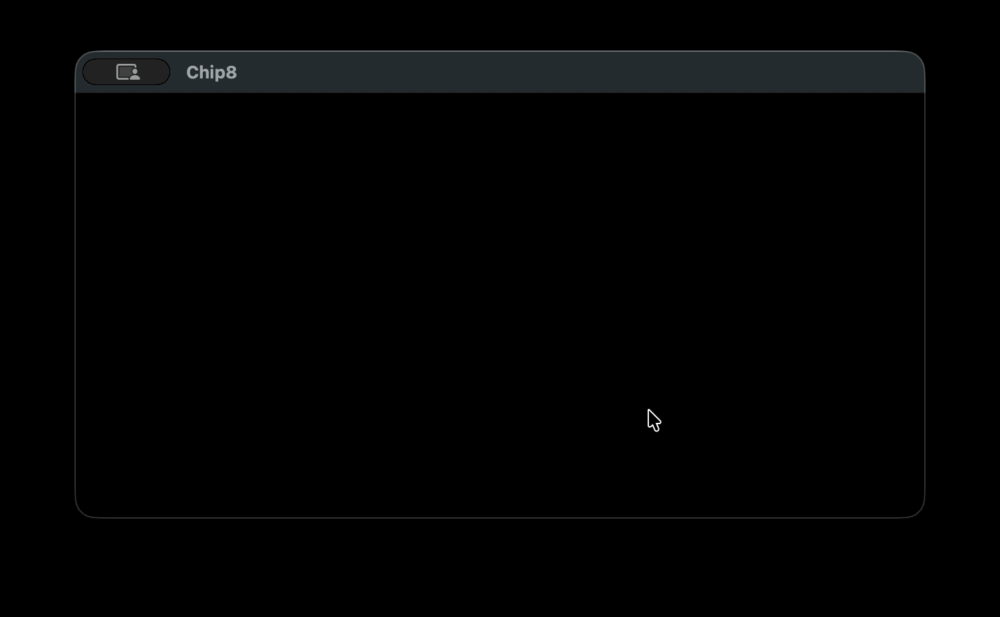

# chip-8-emu

A CHIP-8 emulator written in C++17 from scratch.



## What is CHIP-8?

CHIP-8 is an interpreted programming language developed in the mid-1970s for 8-bit microcomputers. It was designed to make game development easier and runs on a simple virtual machine with 16 registers, 4KB of memory, and a 64×32 pixel monochrome display.

## Building

**Dependencies:**
- CMake 3.14+
- SDL2
- C++17 compiler

**macOS:**
```bash
brew install sdl2 cmake
mkdir build && cd build
cmake ..
make
```

**Linux:**
```bash
sudo apt-get install libsdl2-dev cmake
mkdir build && cd build
cmake ..
make
```

## Usage
```bash
./chip8 <rom>
```

**Example:**
```bash
./chip8 roms/tetris.ch8
```

## Controls

CHIP-8 has a 16-key hex keypad mapped to your keyboard:
```
CHIP-8    Keyboard
1 2 3 C   1 2 3 4
4 5 6 D   Q W E R
7 8 9 E   A S D F
A 0 B F   Z X C V
```

## ROMs

ROMs are not included in this repository. You can download a large collection of public domain CHIP-8 ROMs from the [CHIP-8 Archive](https://johnearnest.github.io/chip8Archive/).

## Credits

- [Austin Morlan](https://austinmorlan.com/posts/chip8_emulator/) — whose guide was a helpful reference during development
- [Cowgod's CHIP-8 Technical Reference](http://devernay.free.fr/hacks/chip8/C8TECH10.HTM) — the definitive CHIP-8 specification
- [CHIP-8 Archive](https://johnearnest.github.io/chip8Archive/) — public domain ROM collection by John Earnest

## License

MIT
